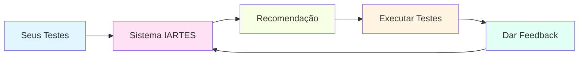

# 🎯 IARTES - Sistema de Recomendação para Testes

> **Interactive Adaptive Recommendation for Test Execution Sequencing**  
> Sistema de Machine Learning para Ordenação Inteligente de Casos de Teste Manuais

---

## 🚀 INÍCIO RÁPIDO

```bash
# 1. Instalar
pip install -r requirements.txt

# 2. Testar
python test_install.py

# 3. Executar demo
python examples/demo_basic.py
```

---

## 📂 ESTRUTURA DO PROJETO

```
IARTES/
│
├── 📘 DOCUMENTAÇÃO
│   ├── README.md                    # Documentação completa
│   ├── QUICK_START.md              # Guia rápido (5 min)
│   ├── INSTRUCOES_USO.md           # Instruções detalhadas
│   ├── PROJETO_DESENVOLVIDO.md     # Detalhes técnicos
│   └── INDEX.md                    # Este arquivo
│
├── 🧪 EXEMPLOS
│   ├── demo_basic.py               # Demo básico (~30s)
│   ├── advanced_training.py        # Treinamento ML (~2min)
│   └── integrate_real_tests.py     # Template de integração
│
├── 🧠 CÓDIGO FONTE (src/)
│   │
│   ├── models/
│   │   └── test_case.py            # Modelos de dados
│   │       • TestCase
│   │       • Action (5 tipos)
│   │       • ExecutionFeedback
│   │       • RecommendationResult
│   │
│   ├── features/
│   │   └── feature_extractor.py    # Extração de 18+ features
│   │       • Features individuais
│   │       • Features pareadas
│   │       • Features agregadas
│   │
│   ├── recommender/
│   │   └── ml_recommender.py       # Sistema de ML
│   │       • Heurísticas inteligentes
│   │       • Random Forest
│   │       • Gradient Boosting
│   │       • Aprendizado adaptativo
│   │
│   └── utils/
│       └── data_generator.py       # Gerador de dados sintéticos
│
├── 💾 MODELOS
│   └── (Modelos treinados .pkl salvos aqui)
│
├── ⚙️ CONFIGURAÇÃO
│   ├── requirements.txt            # Dependências Python
│   ├── setup.py                    # Instalação do pacote
│   ├── .gitignore                  # Arquivos ignorados
│   └── test_install.py             # Teste de instalação
│
└── 📄 DADOS DO PROJETO
    └── arquivos/
        └── Artigo.pdf              # Artigo da pesquisa
```

---

## ✨ FUNCIONALIDADES PRINCIPAIS

### 🎯 Ordenação Inteligente
- ✅ Respeita dependências entre testes
- ✅ Agrupa por módulo (reduz context switching)
- ✅ Prioriza ações não-destrutivas
- ✅ Minimiza reinicializações do sistema

### 🤖 Machine Learning Adaptativo
- ✅ Aprende com feedback humano
- ✅ Melhora progressivamente
- ✅ Adapta-se a diferentes perfis
- ✅ Dois modelos: Random Forest e Gradient Boosting

### 💬 Feedback Human-in-the-Loop
- ✅ Feedback explícito (ratings 1-5)
- ✅ Feedback implícito (tempo, sucesso, resets)
- ✅ Aprendizado incremental
- ✅ Re-treinamento automático

### 📊 Métricas e Análise
- ✅ Tempo total estimado
- ✅ Número de reinicializações
- ✅ Taxa de aceitação
- ✅ Confiança da recomendação

---

## 🎓 GUIAS POR NÍVEL

### 👶 Iniciante
**Objetivo:** Entender o sistema

1. Leia [`QUICK_START.md`](QUICK_START.md)
2. Execute `python examples/demo_basic.py`
3. Explore o código comentado

⏱️ Tempo: 15 minutos

---

### 👨‍💻 Intermediário
**Objetivo:** Treinar o modelo

1. Leia [`INSTRUCOES_USO.md`](INSTRUCOES_USO.md)
2. Execute `python examples/advanced_training.py`
3. Analise os resultados

⏱️ Tempo: 30 minutos

---

### 🚀 Avançado
**Objetivo:** Integrar com seus dados

1. Leia [`PROJETO_DESENVOLVIDO.md`](PROJETO_DESENVOLVIDO.md)
2. Adapte `examples/integrate_real_tests.py`
3. Implemente em produção

⏱️ Tempo: 1-2 horas

---

## 📈 WORKFLOW DE USO



1. **Entrada**: Seus casos de teste
2. **Processamento**: Sistema analisa e ordena
3. **Saída**: Ordem recomendada
4. **Execução**: Você executa na ordem sugerida
5. **Feedback**: Sistema aprende e melhora

---

## 🔢 NÚMEROS DO PROJETO

| Métrica | Valor |
|---------|-------|
| **Linhas de Código** | ~2.500 |
| **Módulos Python** | 7 |
| **Features Extraídas** | 18+ |
| **Exemplos Inclusos** | 3 |
| **Documentação** | 5 arquivos |
| **Dependências** | 6 principais |
| **Tempo de Setup** | < 5 minutos |

---

## 🎯 RESULTADOS ESPERADOS

Com base em simulações:

| Métrica | Melhoria Estimada |
|---------|-------------------|
| ⏱️ **Tempo Total** | -10% a -20% |
| 🔄 **Reinicializações** | -30% a -50% |
| ⭐ **Satisfação** | +40% |
| 🎯 **Confiança** | 90%+ após 50 feedbacks |

---

## 🛠️ TECNOLOGIAS UTILIZADAS

- **Python 3.8+**
- **scikit-learn** - Machine Learning
- **NumPy** - Computação numérica
- **Pandas** - Manipulação de dados

### Modelos ML Implementados

1. **Random Forest** (padrão)
   - Robusto a overfitting
   - Bom para começar
   
2. **Gradient Boosting** (avançado)
   - Mais preciso com mais dados
   - Requer mais ajuste

---

## 📚 REFERÊNCIAS ACADÊMICAS

Este sistema implementa conceitos dos seguintes trabalhos:

1. **Myers et al. (2011)** - The Art of Software Testing
2. **Yoo & Harman (2012)** - Test Case Prioritization
3. **Itkonen et al. (2009)** - How do testers do it?

Veja [`arquivos/Artigo.pdf`](arquivos/Artigo.pdf) para detalhes completos.

---

## 🤝 CONTRIBUIÇÕES

Este é um projeto de pesquisa acadêmica desenvolvido para:

**Universidade:** [Sua Universidade]  
**Curso:** [Seu Curso]  
**Disciplina:** [Disciplina]  
**Autor:** Marcelo dos Santos Saraiva Junior

---

## 📞 SUPORTE

Encontrou um problema? Tem uma sugestão?

1. Consulte a documentação apropriada acima
2. Verifique os exemplos de código
3. Execute `test_install.py` para diagnóstico

---

## ⚖️ LICENÇA

Projeto acadêmico - Pesquisa IARTES  
Desenvolvido em Janeiro de 2026

---

## 🎉 COMECE AGORA!

Escolha seu caminho:

| Eu quero... | Vá para... | Tempo |
|-------------|-----------|-------|
| 🎯 Ver funcionando rapidamente | [`QUICK_START.md`](QUICK_START.md) | 5 min |
| 📖 Entender detalhadamente | [`README.md`](README.md) | 15 min |
| 💻 Usar com meus testes | [`INSTRUCOES_USO.md`](INSTRUCOES_USO.md) | 30 min |
| 🔬 Detalhes técnicos | [`PROJETO_DESENVOLVIDO.md`](PROJETO_DESENVOLVIDO.md) | 45 min |

---

**Desenvolvido com 💙 para melhorar a eficiência de testes manuais**

*Sistema IARTES - Interactive Adaptive Recommendation for Test Execution Sequencing*
